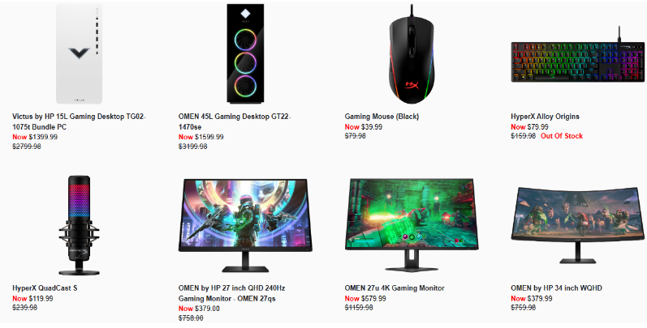

# YasiCom

## Overview

This project is a full-stack web application designed for an online store. It encompasses both the client area, where users can view and interact with products, and an admin dashboard, providing tools for managing the store, products, orders, and stock.

## Features

### Client Area - Loading Product Content Feature

#### Displaying Products:

- The web app loads product content from the database to showcase available items to users.
- The home route (/home) curates a list of best deals, sorted from higher to lower prices.

##### **Algorithm/Code Snippet:**

  - Utilizes Flask routes (/products and /home) to query and retrieve products.
  - Renders products on client-facing pages (products.html and home.html).

### Admin Login Feature

#### Admin Login:

- Admin can log in to access the admin dashboard.
- Implements a form or route for admins to input their email and password for authentication.

##### **Algorithm/Code Snippet:**

  - Utilizes Flask routes (/admin/login) for admin login functionality.
  - Validates admin credentials and grants access to the admin dashboard.

### Admin Dashboard - Managing Store, Products, Orders, and Stock Feature

#### Store Management:

- The admin dashboard provides tools for adding, editing, and removing products.
- Admin can view and process orders and manage stock levels.

##### **Algorithm/Code Snippet:**

  - Utilizes Flask routes (/admin/dashboard) to handle admin dashboard functionality.
  - Implements backend logic for managing products, orders, and stock.

### Admin Area - Add a Product Feature

#### Adding a Product:

- Admin can add a new product to the store.
- Implements a form or route for admins to input product details and add a new product to the database.

##### **Algorithm/Code Snippet:**

  - Utilizes Flask routes (/admin/add_product) to handle the addition of a new product.
  - Captures form input and adds the product details to the database.

### Admin Area - Product Management

#### Editing, Deleting, and Viewing a Product details:

- Admin can edit existing products (images, description, cost, product name), delete products, and view detailed information about each product.
- Implements routes and functionality to manage products.

##### **Algorithm/Code Snippet:**

  - Utilizes Flask routes for viewing (/admin/edit_products), editing (/admin/edit_product/<product_id>), deleting (/admin/delete_product/<product_id>/).
  - Handles product updates, deletions, and detailed views in the backend.

### Admin Area - Stock Management Feature

#### Freezing/Unfreezing Stock:

- Admin can control the availability of a product by freezing or unfreezing its stock.
- Incorporates a mechanism to update the stock status.

##### **Algorithm/Code Snippet:**

  - Utilizes Flask routes (/admin/stock/<product_id>) to manage stock status.
  - Updates stock status in the database based on admin actions.

### Admin Area - Order Management Feature

#### View Orders, View Order Details, Update Order Status:

- Admin can manage orders, view a list of all orders, view detailed information for each order, and update the order status.
- Implements mechanisms to retrieve and display order information.

##### **Algorithm/Code Snippet:**

  - Utilizes Flask routes (/admin/view_orders, /admin/view_order) for order management.
  - Retrieves, displays, and updates order's status  in the backend.

## Project Timeline

Completed in the span of almost two and a half weeks, this project is a testament to dedication and newfound expertise in full-stack engineering.

## Connect with Me

For more projects and professional insights, connect with me on [LinkedIn](https://www.linkedin.com/in/fouad-yasin-76a489270/).

